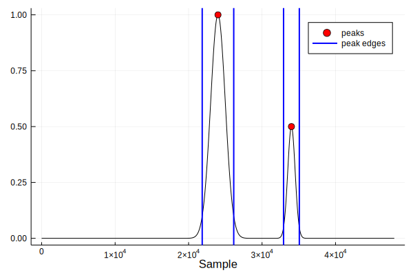

# FindPeaks1D
[](https://travis-ci.org/ymtoo/FindPeaks1D.jl)
[](https://codecov.io/gh/ymtoo/FindPeaks1D.jl)


Finding peaks in a 1-D signal in Julia. The implementation is based on `find_peaks` in `scipy`.

## Usage
```julia
julia> using FindPeaks1D, ImageFiltering, Plots

julia> n = 48001
julia> s1 = ImageFiltering.Kernel.gaussian((1000,), (n,))
julia> s2 = ImageFiltering.Kernel.gaussian((500,), (n,))
julia> s = s1.parent/maximum(s1.parent) + 0.5 * circshift(s2.parent/maximum(s2.parent), (10000,))

julia> pkindices, properties = findpeaks1d(s; height=0.1, prominence=0.2, width=1000.0, relheight=0.9)

julia> plot(s; color="black", label=false)
julia> scatter!(pkindices, s[pkindices]; color="red", markersize=5, label="peaks")
julia> vline!(properties["leftips"]; color="blue", width=2, label="peak edges")
julia> vline!(properties["rightips"]; color="blue", width=2, label=false)
julia> xlabel!("Sample")
```

